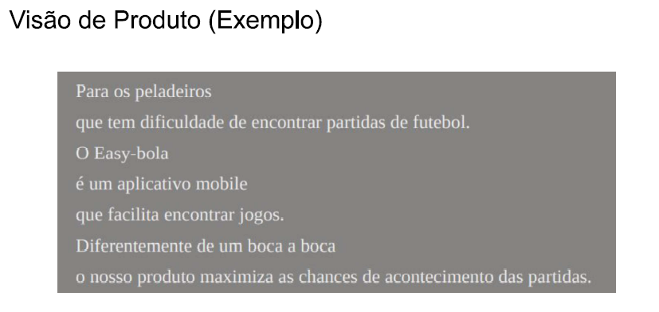
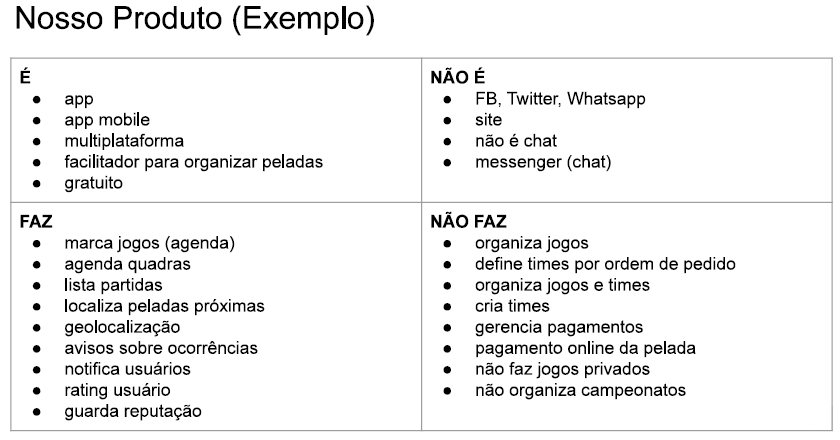
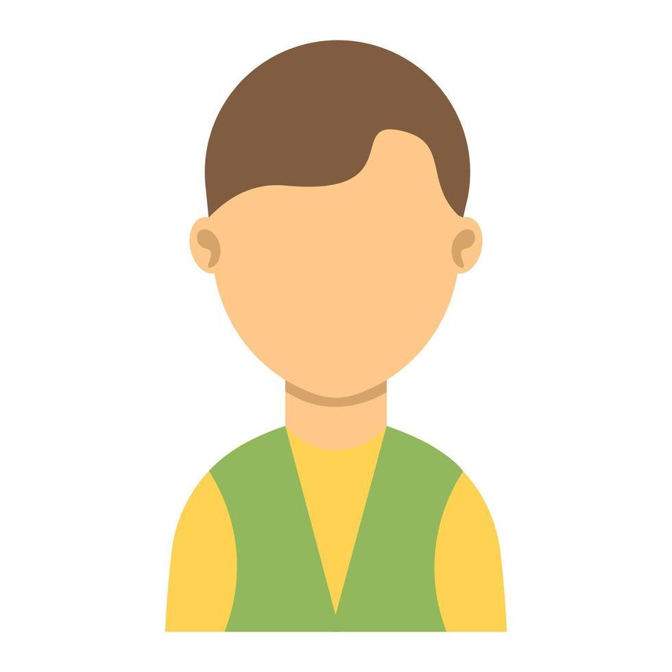

# 2. Nosso Produto

_Estão seçaõ explora um pouco mais o produto a ser desenvolvido_

## 2.1 Visão do Produto

## 2.2 Nosso Produto

## 2.3 Personas
<h2>Persona 1</h2>
<table>
  <tr>
    <td style="vertical-align: top; width: 150px;">
      
    </td>
    <td style="vertical-align: top; padding-left: 10px;">
      <strong>Nome:</strong> Ana Souza  
      <strong>Idade:</strong> 32 anos  
      <strong>Hobby:</strong> Ler livros de ficção científica  
      <strong>Trabalho:</strong> Desenvolvedora de software  
      <strong>Personalidade:</strong> Analítica, criativa e determinada  
      <strong>Sonho:</strong> Criar uma startup de tecnologia  
      <strong>Dores:</strong> Falta de tempo para equilibrar trabalho e vida pessoal  
    </td>
  </tr>
</table>

